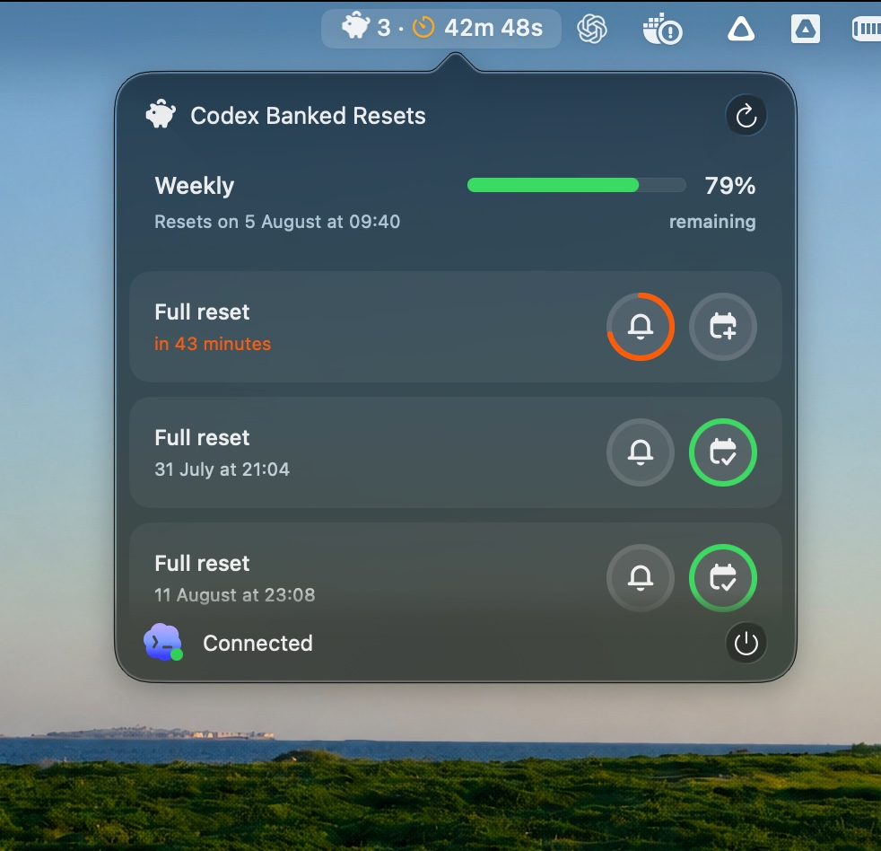

  

# Codex Piggy Bank

A lightweight macOS menu bar app for tracking Codex usage limits and banked reset expiration times.

## Features

- See your 5-hour and weekly Codex usage limits.
- Track banked resets in expiration order and in your Mac's current time zone.
- Get optional notifications 1 hour, 10 minutes, and 5 minutes before expiration.
- Add or remove Calendar events with the same three alerts.

## Download

1. Download the latest universal DMG from [GitHub Releases](https://github.com/gnlca/codex-piggy-bank/releases/latest).
2. Open the DMG and drag **Codex Piggy Bank** to **Applications**.
3. Launch it from Applications. Codex CLI 0.144.0 or later must already be installed and authenticated.

## Read only by design

Codex Piggy Bank only reads usage data through `account/rateLimits/read`. It never logs in, updates Codex, consumes a reset, or calls mutation APIs.
