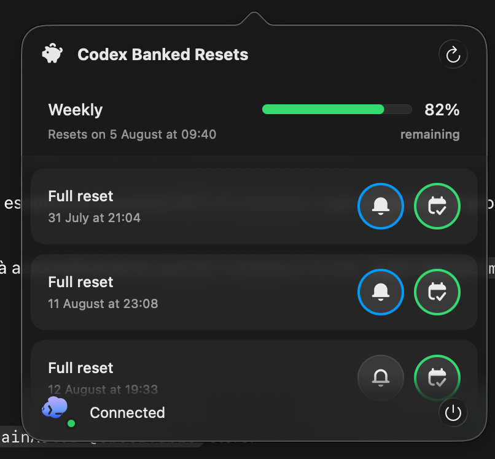

# Codex Banked Resets

A lightweight macOS menu bar app for tracking Codex usage limits and banked
reset expiration times.



## Features

- Shows every usage window returned by Codex, including the 5-hour and weekly
  limits when available.
- Lists banked resets in expiration order.
- Converts Unix timestamps with the Mac's current locale and time zone.
- Highlights resets as they approach expiration.
- Schedules optional local alerts 1 hour, 10 minutes, and 5 minutes before a
  reset expires.
- Adds or removes an optional Calendar event with the same three alerts.
- Refreshes at launch, when the popover opens, after wake, and every 15 minutes.

## Download

1. Download the latest universal DMG from
   [GitHub Releases](https://github.com/gnlca/codex-banked-resets/releases/latest).
2. Open the DMG and drag **Codex Reset Alert** to **Applications**.
3. Launch the app. It appears only in the menu bar.

The release supports Apple silicon and Intel Macs running macOS 14 or later.
Codex CLI 0.144.0 or later must already be installed and authenticated.

## Read-only by design

The app starts `codex app-server --stdio` only while refreshing and terminates
the process immediately afterward. Its RPC allowlist contains only:

1. `initialize`
2. `initialized`
3. `account/rateLimits/read`

It never logs in, updates Codex, consumes a reset, or invokes a mutation RPC.
Only a sanitized snapshot without backend reset IDs is cached in Application
Support.

Notification and Calendar permissions are requested only after clicking their
respective controls.

## Build from source

Requirements: Xcode 26 or later and an authenticated Codex CLI installation.

```sh
git clone https://github.com/gnlca/codex-banked-resets.git
cd codex-banked-resets
./script/build_and_run.sh --verify
```

## Create a signed release

The packaging script builds a universal Release app, signs the app and DMG with
Developer ID, submits the DMG to Apple for notarization, staples the ticket, and
validates the finished artifact.

```sh
export DEVELOPER_ID_APPLICATION='Developer ID Application: NDRT S.R.L. (TEAMID)'
export NOTARY_PROFILE='codex-banked-resets-notary'
./script/package_release.sh
```

No certificate, token, or notarization credential is stored in this repository.
